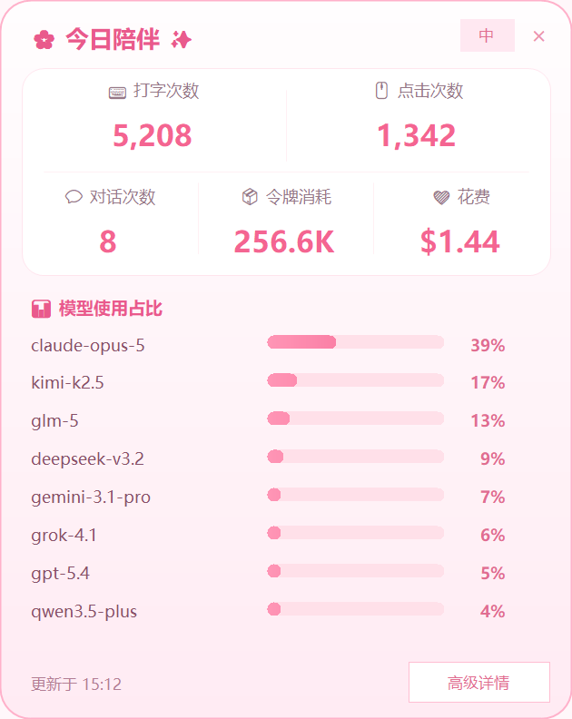
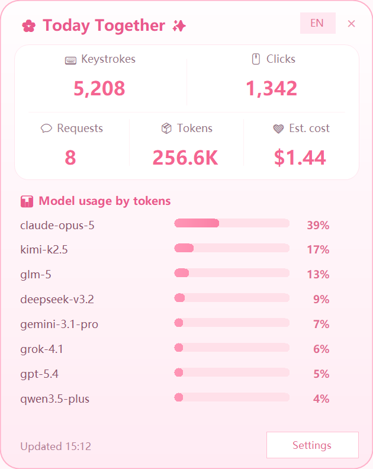

# Nikki Bongo Cat

[English](README.md) · [简体中文](README.zh-CN.md)

一只会跟随键盘、鼠标输入做出反应的 Windows Live2D 桌宠，配有用于查看今日 AI 用量、估算花费和输入次数的统计面板。可以切换粉色、紫色暖暖，管理自己的模型，并单独调整统计面板的大小。

**[下载可直接使用的 Windows x64 成品包](https://github.com/Ding808/Nikki-Bongo-Cat/releases/latest)** · [更新记录](CHANGELOG.md)

成品包已经包含运行所需的组件。**无需安装 .NET、Visual Studio，无需编译，也不需要懂编程。**

## 第一次使用：通过 Steam 启动暖暖

先在 Steam 中安装免费的 [Bongo Cat](https://store.steampowered.com/app/3419430/Bongo_Cat/)。如果它正在运行，先关闭，再按下面的步骤设置。

1. **下载成品包。** 打开[最新版本发布页](https://github.com/Ding808/Nikki-Bongo-Cat/releases/latest)，在 **Assets** 下点击 **`Nikki-Bongo-Cat-win-x64.zip`**。不要点击仓库的绿色 **Code** 按钮，也不要下载 **Source code**：它们是给开发者看的源码，不包含编译好的统计程序 EXE。

2. **完整解压到一个固定文件夹。** 右键下载的 ZIP，选择“**全部解压…**”。例如放到 `D:\Apps\Nikki-Bongo-Cat`，也可以放到“文档”里的文件夹。解压完成后打开这个文件夹，再继续下一步；不要在压缩包窗口里直接运行文件，也不要把里面的文件、子文件夹拆开。

3. **双击脚本，自动复制 Steam 启动选项。** 在解压后的文件夹中双击 **`CopySteamLaunchOption.cmd`**。看到已经复制的提示后，点击 **OK**。不需要自己找 EXE，也不需要手动输入命令。

4. **粘贴到 Steam。** 打开 **Steam → 库**，右键 **Bongo Cat**，选择“**属性 → 通用**”。点击“**启动选项**”输入框，先按 **Ctrl+A** 全选旧内容，再按 **Ctrl+V**，用刚才复制的内容完整替换。保留复制内容中的英文双引号和 `%command%`，不要自行修改。

5. **从 Steam 启动。** 关闭属性窗口，回到 Steam 库，点击 Bongo Cat 的“**开始游戏**”。暖暖和统计程序会一起启动。以后使用时，也从 Steam 点击“开始游戏”即可。

6. **切换中文、调整面板大小。** 鼠标靠近暖暖后，点击旁边的 **Today Together** 小入口打开面板。首次启动默认英文，依次点击右上角 **EN → Language → Chinese** 即可切换中文。然后通过“**高级详情 → 面板大小**”选择大小或输入自定义百分比。语言和大小都会自动保存。

**设置好以后，请保持解压文件夹的位置不变。** Steam 记住的是它的完整路径。如果移动了文件夹，或将新版本解压到另一个文件夹，请在新位置重新操作第 **3–4 步**，更新 Steam 启动选项后再启动。

### 不通过 Steam，也可以使用

完成上面的下载和解压步骤 **1–2** 后，在解压文件夹中双击 **`StartPetWithStats.cmd`** 即可。无需设置 Steam，也能使用桌宠和统计功能；这种启动方式不使用 Steam 游玩时长模式。

## 界面预览


实际 Live2D 桌宠的透明背景渲染图。



真实中文界面，使用演示统计数据；图中数字不代表任何用户的账户用量或账单。



相同面板的英文界面。首次启动默认英文，可以直接在面板内切换中文；面板、菜单、提示和自定义界面随之即时切换。

## 功能

- Live2D 桌宠随键鼠输入播放动作；内置粉色、紫色暖暖，记住上次选择。
- 查看今日读取到的 AI 请求数、令牌用量、美元估算花费、打字次数和鼠标点击次数。
- 按令牌用量计算模型使用占比；模型列表可以滚动，不会因为模型较多而隐藏其他模型。
- 读取 Claude 桌面端本地会话缓存，支持独立安装版和微软商店版；读取 Codex、Claude Code 及兼容格式的本地日志。
- 内置模型价格目录，支持在线更新和手动覆盖价格；缺少价格的模型仍计入令牌总数和模型占比。
- 默认英文，在面板内即可切换中文，并记住语言选择。
- 统计面板可独立设置为 65%–175%，也可输入自定义百分比。
- 仅从**可见桌宠本体**开始的左键拖动、右键缩放会操作桌宠；透明空白区域可以正常点击其他应用。
- 锁定后整个桌宠允许鼠标穿透；另支持 Steam 游玩时长启动模式。

## 系统要求

- Windows 10/11，64 位，显卡驱动支持内置 Live2D/OpenGL 渲染器。
- 普通模式不需要 Steam。Steam 模式需要在库中安装免费的 [Bongo Cat](https://store.steampowered.com/app/3419430/Bongo_Cat/)。
- 只有从源码构建时才需要 .NET 9 SDK。

请将成品包里的 EXE、DLL、`img`、`Resources` 保持在一起。建议解压到当前账户有写入权限的文件夹，因为桌宠设置和模型修改会保存在程序目录中。

## 常用操作

| 操作 | 方法 |
| --- | --- |
| 打开统计面板 | 点击桌宠旁的小入口，或在托盘菜单选择“打开统计面板”。 |
| 切换语言 | 英文界面点击 **EN → Language → Chinese** 切换中文；中文界面点击“**中 → 语言**”选择语言。也可使用“高级详情 → 语言”。 |
| 调整统计面板大小 | “高级详情 → 面板大小”，选择预设或“自定义大小…”（65%–175%）。 |
| 移动桌宠 | 解锁后，在可见桌宠本体上按住左键拖动。 |
| 缩放桌宠 | 解锁后，在可见桌宠本体上按住右键；向右或向下拖动放大，向左或向上拖动缩小，松开右键结束。 |
| 锁定／解锁桌宠 | 小键盘 **−**／**+**，或使用面板、托盘的锁定选项。 |
| 始终显示小入口 | “高级详情 → 常驻入口”。未开启时，入口通常在鼠标靠近桌宠时显示。 |
| 更改小入口显示的数据 | “高级详情 → 浮窗显示指标”。 |
| 切换皮肤 | “高级详情 → 切换皮肤”，也可使用托盘菜单。 |
| 管理模型和按键 | “高级详情 → 自定义桌宠”；桌宠获得焦点时，**Ctrl+Shift+S** 也可打开双语编辑器。 |
| 应用修改 | 在自定义界面选择“保存并重启”。 |
| 重置输入次数 | “高级详情 → 重置今日”重置今日打字与鼠标计数；AI 用量来自日志，不会被此操作删除。 |

语言和面板大小会自动保存。较大的面板会适配显示器的可用区域。桌宠本体与统计面板分别调整大小。启动时原有的“可交互”字样已移除。

## AI 用量和花费如何统计

### 数据从哪里来

程序读取当前电脑已经保存的用量元数据，不需要填写 API 密钥，也不需要登录 AI 账户。

| 来源 | 能读取的内容 |
| --- | --- |
| Claude 桌面端 | 本地 `claude.ai` IndexedDB 数据库中缓存的会话模型和用量信息，支持独立安装版、微软商店版。 |
| Claude Code | 会话／项目用量记录，通常位于 `%USERPROFILE%\.claude\projects`。 |
| Codex | 会话用量日志，通常位于 `%USERPROFILE%\.codex\sessions`，以及兼容格式的桌面端日志。 |
| Gemini CLI | `%USERPROFILE%\.gemini\tmp` 中保存的 JSON 会话记录，包括缓存输入和思考令牌。 |
| 其他客户端和模型网关 | 自动发现或手动添加的文件夹中，符合已支持格式的 JSON/JSONL/NDJSON 用量记录；支持常见 OpenAI、Anthropic、Gemini 用量字段。 |

程序会检查 Claude、Codex、Gemini CLI、Kimi CLI、Qwen Code、OpenCode JSON 存储、Cursor、Windsurf、Continue，以及 Cline／Roo／Kilo 的常用任务目录。**发现一个目录，不等于该客户端的所有版本都提供可读取的令牌用量。** 网页会话、远程账户记录，或没有在本机保存用量的客户端，不能凭空补出统计数据。

Claude 桌面端可能清理缓存，也可能没有缓存尚未在本机打开的会话。程序只能统计实际存在的用量元数据；不会通过计算提示词字数伪造缺失记录。客户端更新也可能改变本地存储格式。缺少可用时间戳的记录无法归入今日，因此不计入今日数据。统计在启动时更新，之后约每分钟刷新一次，以电脑的本地日期区分“今日”。

如果 Claude 桌面端的同一次查询明确跨过本地午夜，总摘要就无法可靠拆分到两天。程序会跳过该摘要，保留能按时间逐条归日的消息用量。因此，这次查询在相关日期的统计可能不完整。

“对话次数”对应**去重后读到的用量记录数**，不一定等于聊天窗口或会话线程数量。“模型使用占比”按各模型的令牌数计算，不代表花费占比，也不代表订阅额度的使用比例。较小的非零占比显示为 **<1%**，不会显示成零；鼠标停在模型名或百分比上，可查看令牌数和更精确的占比。

### 支持的模型与价格

价格目录覆盖主流模型厂商及多个网关，包括 OpenAI、Anthropic Claude、Google Gemini/Vertex、xAI Grok、Moonshot/Kimi、智谱 Z.ai/GLM、DeepSeek、阿里 Qwen、Mistral、Cohere、通过服务商托管的 Meta Llama、MiniMax、Perplexity，以及 OpenRouter、Groq、Together、Fireworks、Azure、Amazon Bedrock 等。具体能否匹配价格，还取决于模型的准确标识、调用渠道，以及目录中是否包含可使用的价格字段。

成品包内置 **2026-09-11** 的离线价格快照，包含 **90 个服务商标识下的 2,959 条聊天／补全／Responses 价格记录**（包括别名和部署，不代表 2,959 个不同的基础模型），默认每 24 小时尝试更新公开的 [LiteLLM 价格目录](https://github.com/BerriAI/litellm/blob/main/model_prices_and_context_window.json)。网络更新失败时仍可使用内置／缓存价格。程序会在已支持的规则内处理常见模型别名、厂商前缀、日期后缀和推理强度标签。价格来源和范围见[价格目录说明](docs/model-pricing.md)。

**花费是按 API 单价折算的美元估算值，不是 Claude Max、ChatGPT 或其他订阅服务的实际账单。** 日志中有明确、可用的花费时优先使用该值；否则按已支持的输入、输出和缓存价格计算。厂商的计费规则、折扣、税费、非令牌收费和未公开用量都可能导致实际账单不同。

没有匹配价格时，模型的令牌数和占比仍然保留。面板会显示缺价记录数量；金额后面的 **+** 表示只统计了已知部分，**—** 表示没有可用的已计价总额。对于私有网关或缺少准确型号价格的模型，可以添加自定义单价。

### 添加日志目录或自定义价格

通过“高级详情 → 打开设置”找到 `pet-stats-settings.json`。编辑前先退出统计程序，将需要的字段合并进现有文件，保存后重新启动。路径支持 `%USERPROFILE%`、`%APPDATA%`、`%LOCALAPPDATA%` 和 `~`。

```json
{
  "ExtraLogRoots": ["D:\\AI-logs"],
  "ScanJsonFiles": true,
  "CompanionUi": {
    "Language": "zh",
    "PanelScale": 1.25
  },
  "Prices": [
    {
      "Pattern": "my-private-model",
      "Provider": "my-gateway",
      "InputPerMillion": 1.0,
      "OutputPerMillion": 4.0,
      "CacheReadPerMillion": 0.1,
      "CacheWrite5mPerMillion": 1.25,
      "CacheWrite1hPerMillion": 2.0
    }
  ]
}
```

`Pattern` 可以填写准确的模型标识，也可使用 `private-*` 这样的通配符；`Provider` 可省略。示例中的价格是**演示用虚构数字**，请替换为实际服务商公布的每百万令牌美元单价。日志使用 `.json` 而非 `.jsonl` 时，开启 `ScanJsonFiles`。建议只添加存放用量日志的文件夹，不要选择整个磁盘。需要逐个目录设置时，可使用 `LogRoots`，每项包含 `Name`、`Path`、`ProviderHint`、`ScanJsonFiles` 和 `Enabled`。

## 隐私、数据保存和升级

| 位置 | 用途 |
| --- | --- |
| `%LOCALAPPDATA%\PetStatsOverlay\state.json` | 保存在本机的每日打字、鼠标计数。 |
| `PetStatsOverlay\pet-stats-settings.json` | 语言、面板大小、日志目录、自定义价格。 |
| `%LOCALAPPDATA%\PetStatsOverlay` | 程序数据和价格缓存；可通过“高级详情 → 打开数据文件夹”访问。 |
| `config.json` | 渲染器设置、当前皮肤／模型。 |
| `img\standard\live2d_models` | 模型库，以及各模型的配置和资源。 |
| `.petstats_backups` | 受支持的自定义操作生成的本地备份。 |

AI 日志和 Claude 会话缓存仅在本机读取。程序不会上传提示词、会话正文或用量记录；自动联网请求用于下载公开价格数据。输入统计只累计按键、鼠标活动次数，不保存输入的文字内容。

升级时先退出统计程序和桌宠，从[最新版本发布页](https://github.com/Ding808/Nikki-Bongo-Cat/releases/latest)下载成品 ZIP，完整解压到新文件夹，再复制需要保留的 `pet-stats-settings.json`、自定义模型和配置。**通过 Steam 使用时，务必在新文件夹中双击 `CopySteamLaunchOption.cmd`，再将新复制的内容完整粘贴到 Steam 的“启动选项”。** 每日输入历史仍保存在 Windows 用户目录中。发布压缩包排除作者的个人设置、日志、缓存、备份、构建中间文件和测试输出。

## Live2D 模型与自定义

在“自定义桌宠”中，可以切换内置皮肤，设置动作／表情按键，替换受支持的图片，导入模型文件夹或 ZIP 整包，并导出模型整包。

模型文件夹根目录必须包含且只包含一个 `*.model3.json`，以及它引用的 Moc 和贴图等资源。程序会将选中的模型库内容同步到 `img\standard\cat_model`，供桌宠运行时使用。`petstats-live2d-profile.json` 保存该模型的按键和设置；`petstats-assets` 保存配套图片和音效。修改后使用“保存并重启”或“应用选中模型并重启”生效。

## Steam 游玩时长模式

完整设置方法见上方的“[第一次使用：通过 Steam 启动暖暖](#第一次使用通过-steam-启动暖暖)”。设置完成后，可以从 Steam 启动 Bongo Cat，也可以双击 **`StartPetWithStats.Steam.cmd`**，由它请求 Steam 启动。

自动生成的命令会使用当前实际解压路径：

```text
"<实际解压目录>\PetStatsOverlay\PetStatsOverlay.exe" --steam-launcher %command%
```

请保留英文双引号和 `%command%`。移动文件夹后，重新运行复制脚本并更新 Steam 启动选项。这个模式由 Steam 启动统计程序和一只内置暖暖桌宠；统计程序的运行时间用于累计游玩时长。结束使用时关闭桌宠／统计程序。

### 启动参数

| 参数 | 用途 |
| --- | --- |
| `--launch-pet` | 启动内置桌宠和统计面板。 |
| `--steam-launcher` | 用于 Steam 启动选项的入口。 |
| `--steam` | 请求 Steam 启动 App 3419430，随后退出。 |
| `--help` | 显示启动帮助。 |

旧参数 `--attach-steam-bongo-cat` 仍可使用，与 `--steam-launcher` 等效。

## 常见问题

| 问题 | 处理方法 |
| --- | --- |
| 提示找不到 `PetStatsOverlay.exe` | 返回[最新版本发布页](https://github.com/Ding808/Nikki-Bongo-Cat/releases/latest)，在 **Assets** 下下载 **`Nikki-Bongo-Cat-win-x64.zip`** 并完整解压。不要继续在源码文件夹里找 EXE。 |
| 只看到 `.cs` 文件，或者是通过 **Code** 下载的 | 这是源码。请改为从 **Releases** 下载上面指定的成品 ZIP，无需自己编译。 |
| 复制脚本提示找不到程序 | 打开完整解压后的成品文件夹，在里面运行 `CopySteamLaunchOption.cmd`。不要在 ZIP 内运行，也不要单独把这个脚本复制出来。 |
| 有模型令牌数，但没有花费 | 查看缺价提示，检查日志里的准确模型标识、价格更新网络和自定义 `Prices`。 |
| 出现了今天没有主动选择的模型 | 面板会汇总本机 Codex、Claude 等应用的日志，包括日志中真实记录的后台或辅助调用。例如，用 Codex 排查这个项目的会话，本身也可能产生统计用量。是否计入今天，以记录中的实际调用时间为准，不按会话打开时间或文件修改时间判断。 |
| Claude 桌面端用量没有出现 | 在 Claude 中打开对应会话，让本地缓存更新，再等待下一次统计刷新；未缓存的用量无法恢复。 |
| 其他客户端没有被统计 | 确认其日志包含用量和时间字段，并添加对应目录。添加厂商名称不会获得账户账单访问能力。 |
| 编辑设置后没有生效 | 退出统计程序，确认设置是有效 JSON，保存后重启。 |
| 桌宠不能拖动 | 按小键盘 **+** 或选择“解锁桌宠”，再从可见本体开始拖动。请通过配套启动器启动，让桌宠和统计程序使用相同权限。 |
| 统计面板太大 | 调低“面板大小”；更多模型可在列表内滚动查看。 |
| Steam 启动了原版猫、错误的程序，或没有启动 | 先关闭正在运行的桌宠。在准备使用的成品文件夹中双击 `CopySteamLaunchOption.cmd`，再用复制的内容**完整替换** Steam 的“启动选项”，然后从 Steam 重新启动。移动目录、升级到新目录后都需要重新设置。 |

### 可选：核对下载是否完整

每个 Release 都附有 `Nikki-Bongo-Cat-win-x64.zip.sha256` 校验文件。如果希望核对下载完整性，可以在 PowerShell 中运行 `Get-FileHash .\Nikki-Bongo-Cat-win-x64.zip -Algorithm SHA256`，与校验文件中的值比较。这是可选检查，不是安装步骤。

## 开发者：从源码构建和验证

安装 .NET 9 SDK，克隆仓库后，在项目根目录运行：

```powershell
dotnet restore .\PetStatsOverlay\PetStatsOverlay.csproj
dotnet build .\PetStatsOverlay\PetStatsOverlay.csproj -c Release
.\BuildRelease.ps1
```

最后一条命令会构建自包含程序，并生成 **`artifacts\Nikki-Bongo-Cat-win-x64.zip`**，其中包含桌宠运行时、资源、文档和启动器。推送 `v1.1.1` 等版本标签后，GitHub Actions 会使用同样的打包流程，将 ZIP 和 SHA-256 校验文件附加到 Release。验证工作流也会在推送代码和提交拉取请求时运行自动检查。

运行全部回归检查，包括语言和布局检查：

```powershell
.\Test.ps1 -IncludeUi
```

也可以分别运行专项检查：

```powershell
dotnet run --project .\Tests\UsageTests\UsageTests.csproj
dotnet run --project .\Tests\DesktopTests\DesktopTests.csproj
dotnet run --project .\Tests\PetHitTesting\PetHitTesting.csproj
dotnet run --project .\Tests\UiSmoke\UiSmoke.csproj
```

桌宠命中测试还支持 `-- --native <独立测试BongoCatMver的进程号>`，用于验证实际渲染表面的透明度和 Windows 点击路由。此集成模式应针对单独启动、可随时关闭的测试桌宠运行；测试会临时调整该桌宠的窗口样式，并建立一个小型遮挡测试窗口。

```text
PetStatsOverlay/      统计界面、日志读取、价格和桌宠控制
Tests/                用量、桌面缓存、命中区域和界面检查
img/                  图片、音效与 Live2D 模型
Resources/            桌宠运行资源
docs/                 预览图片与发布说明
BuildRelease.ps1      完整成品包构建脚本
```

桌宠渲染器基于 [MMmmmoko/Bongo-Cat-Mver](https://github.com/MMmmmoko/Bongo-Cat-Mver)，公开价格数据来自 [LiteLLM](https://github.com/BerriAI/litellm)。模型美术和运行组件保留各自的原作者署名与许可。
